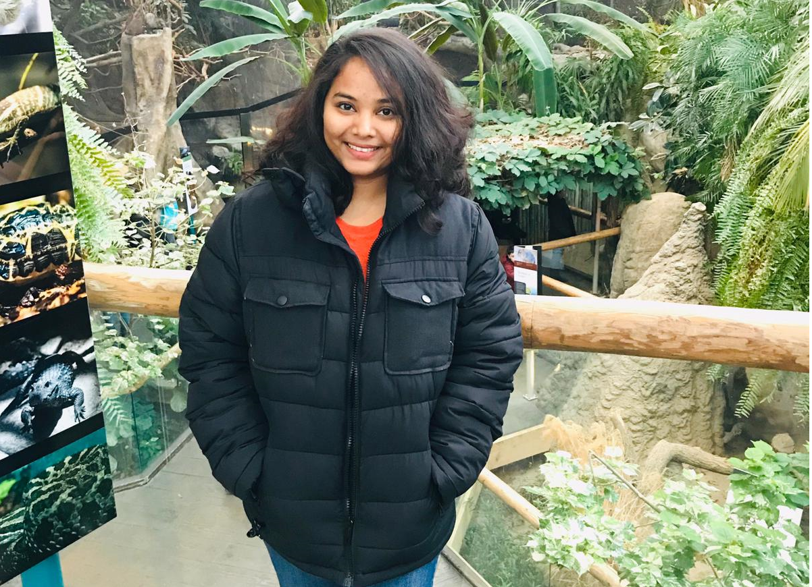
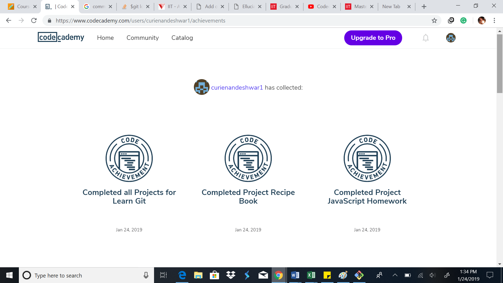

# Curie Nandeshwar

# Where are you from?

I am from city of oranges i.e. Nagpur, India.

# IT Interest
I had been working as a Automation Quality engineer for around 7 years performing automated tests on web application and mobile application. It came to my realization that my interest towards data analytics and visualization is elevating and that it is something to be mastered upon.

# Something Interesting About You

I play sports like Badminton , Swimming , Throw Ball . I have been captain of the Throw Ball competition during High School. I am very fond and highly inspired by  defense people.

# Git tutorial

