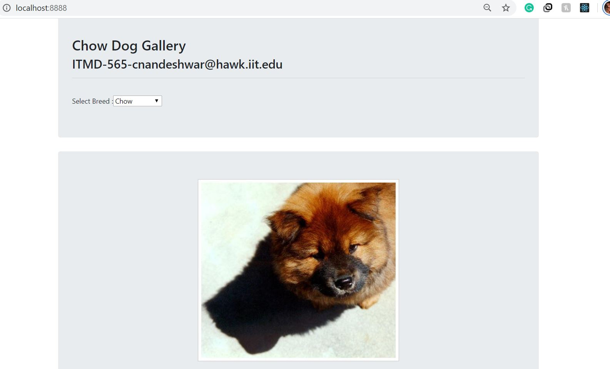

This project was bootstrapped with [Create React App](https://github.com/facebook/create-react-app).

## Project Overview

This project allows you to do the following things. 
 1.  You can select the type of dog you wish to see on the screen.
 2.  A gallery of the selected breed will be displayed on the screen.
 3.  Clicking on any image from the gallery will display that image on the screen.
 4.  The images in the gallery is rendered on the screen using the dog api.
 
### Website look and feel:
   
   
   

## To run the Script

In the project directory, under 'build' folder, you can run:

### `php -S localhost:8888` to start a server 

